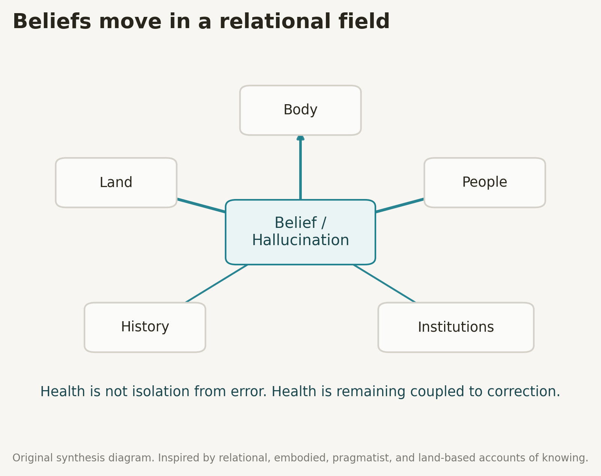
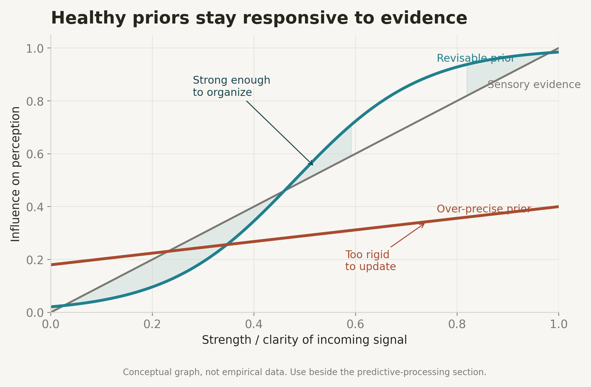
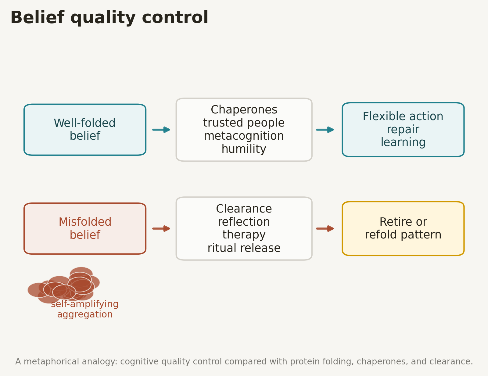
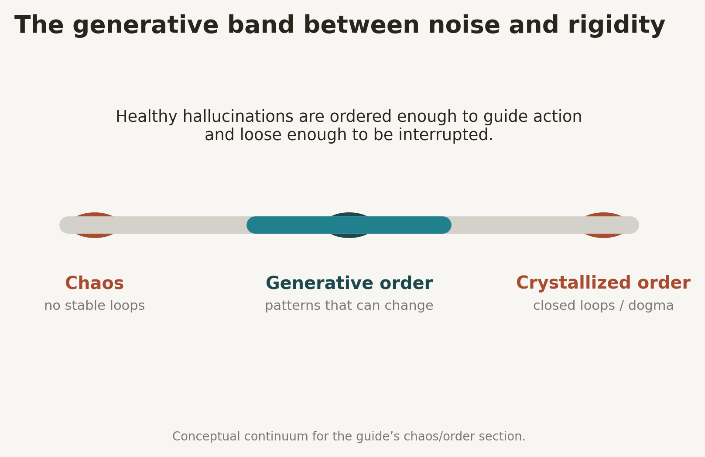
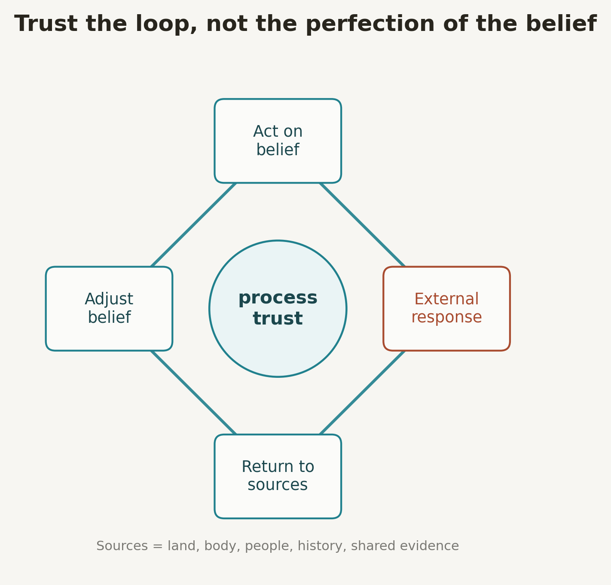
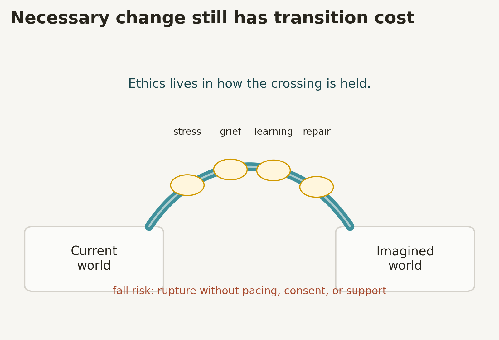

# Field Guide to Healthy Hallucinations

Draft v0.2

## Orientation: What Is a Healthy Hallucination?

Perception is not a camera. It is an active negotiation between body, world, memory, and expectation. Predictive-processing accounts describe perception as an inferential process in which prior expectations are compared with sensory input, and the mismatch between them becomes prediction error that can drive updating ([Hallucinations and Strong Priors](https://pmc.ncbi.nlm.nih.gov/articles/PMC6368358/)).

In that sense, ordinary perception already has something hallucination-like about it. It is not passive reception. It is a constructed appearance, constrained by sensory contact with the world. Anil Seth’s “controlled hallucination” phrase is useful here because the word “controlled” matters as much as “hallucination”: ordinary perception is internally generated, but it remains coupled to world and body ([80,000 Hours interview with Anil Seth](https://80000hours.org/podcast/episodes/anil-seth-predictive-brain-explaining-consciousness/)).

A healthy hallucination is not a fantasy that happens to resemble consensus reality. It is a way of seeing that remains in good relationship with the sources that correct and nourish it: land, body, people, history, and shared evidence. It may be imaginative, symbolic, or visionary, but it stays porous. It can be interrupted by another person’s pain, by the needs of the body, by the weather, by the ground underfoot, or by evidence that refuses to fit.

An unhealthy hallucination is not merely false. It is closed. It feeds on itself. It isolates the believer from correction, reciprocity, and repair. The central claim of this guide is simple:

> There is no such thing as a healthy belief in a vacuum. Beliefs are evaluated by what they do in relationship.

A belief can be beautiful and still be harmful. A vision can be true enough to guide action and still incomplete enough to require humility. The question is not only “Is this real?” but also: What does this belief make more visible? What does it make easier to ignore? Who or what is harmed if action follows from it? What sources remain available for correction?

This guide is a field manual for that return.

## Beliefs in Relationship

### Beliefs as bridges, not mirrors

Beliefs do not float through empty space. Each belief is a bridge between a mind, a body, a place, and a community. A bridge does not deny distance. It spans distance. In one relational field a belief can be stabilizing, even transcendent. In another, the same belief can become destabilizing or dangerous.

Relationship, in this guide, means ongoing mutual influence with the capacity for correction. Something is in relationship with you when it can answer back, change you, be changed by you, and reveal where your model has failed it.

Pragmatist philosophy helps frame beliefs less as static mirrors of reality and more as instruments for action, inquiry, and practical consequence. Peirce’s pragmatic maxim asks what practical bearings a conception has, while James treats theories and concepts as instruments whose value depends partly on how they help experience become workable ([Stanford Encyclopedia of Philosophy: Pragmatism](https://plato.stanford.edu/entries/pragmatism/)).

This guide borrows that practical orientation without reducing truth to convenience. To assess a belief, ask not only whether it corresponds to a statement of fact. Ask what happens to the relational field when that belief begins to move.

**Field rule:** Be generous with mistakes, but always return to sources.

### Land as epistemic source

Many Indigenous land-based knowledge traditions understand knowledge as place-specific, relational, intergenerational, and ecological rather than merely abstract or transferable. Indigenous land-based knowledge is described as knowledge rooted in particular territories, local ecosystems, sustainable use, and the interconnectedness of living and non-living relations ([Indigenous Land-Based Knowledge](https://elbowlakecentre.ca/wp-content/uploads/2023/12/Indigenous-Land-Based-Knowledge.pdf)).

This guide should not treat “land” as a generic aesthetic metaphor. The point is the opposite: land is specific. The ground underfoot has histories, names, wounds, seasons, caretakers, and obligations. A belief is healthier when it deepens reciprocity with the place where it is being lived. A belief is suspect when it erases where it stands.

This can be very small. It may mean learning whose ancestral land you are on, watering a neighborhood tree through a brutal week, understanding local water constraints before preaching abundance, cleaning up a trail, noticing which plants are stressed, or participating in repair instead of only symbolically identifying with “nature.” Land becomes source when it can interrupt fantasy with obligation.

**Practice:** Before accepting a large new belief, ask: What does this do to the ground under my feet?

### Bodies and other people

Embodied cognition rejects the idea that cognition happens in an isolated mind detached from bodily action and environment. The “Four Es” framework describes cognition as embodied, embedded, extended, and enactive, meaning that thinking is shaped by bodily capacities, environmental structure, tools, movement, and interaction ([Stanford Encyclopedia of Philosophy: Embodied Cognition](https://plato.stanford.edu/entries/embodied-cognition/)).

A healthy hallucination therefore keeps contact with actual bodies, not only symbols of bodies. It permits the nervous systems of other people to push back, surprise, co-regulate, and refuse. It notices sleep, hunger, pain, breath, posture, and touch as forms of evidence.

**Practice:** Periodically ask a close other: How does it feel to be around me when I am inside this way of seeing?

## Predictive Processing and Strong Priors

### Controlled hallucination

Predictive-processing models describe perception as the brain’s ongoing attempt to infer the hidden causes of sensory input. Priors are compared with incoming sensation, prediction errors are computed, and belief updating occurs when prediction errors are weighted strongly enough to revise the model ([Hallucinations and Strong Priors](https://pmc.ncbi.nlm.nih.gov/articles/PMC6368358/)).

Hallucinations become more likely when priors are too precise relative to sensory evidence. In that state, expectation can dominate inference and prediction error can be ignored, so perception begins to show what the system expects rather than what the signal supports ([Hallucinations and Strong Priors](https://pmc.ncbi.nlm.nih.gov/articles/PMC6368358/)).

This is the computational backbone of the guide: hallucination-like experience is not alien to perception. It becomes unhealthy when internal models overpower correction. Healthy hallucinations are strong priors that remain update-able, embodied, and socially co-regulated.

### Prior strength and update-ability

One useful axis for this guide is prior strength versus update-ability:

- **Too weak:** The system cannot organize noise into stable pattern.
- **Strong and revisable:** The system can orient, imagine, and act while still changing in response to correction.
- **Over-precise and rigid:** The system resists evidence, isolates from feedback, and mistakes its model for the world.

The key question is not whether a belief is strong. Some strong beliefs are necessary. The key question is whether surprising reality can still change it.

**Field question:** How easy is it for new evidence to actually modify this belief?

### Research graph candidate: conditioned hallucinations

Powers, Mathys, and Corlett used a Pavlovian conditioning task in which a visual cue became associated with a threshold-level tone, then tested whether participants would report tones when the tone was absent. People who heard voices were more susceptible to these conditioned hallucinations, and the model parameter \(\nu\), representing prior weighting relative to sensory evidence, was significantly higher in hallucinators (\(F_{1,55}=13.96\), \(p=4.45 \times 10^{-4}\)) ([Pavlovian Conditioning-Induced Hallucinations](https://pmc.ncbi.nlm.nih.gov/articles/PMC5802347/)).

The most useful research figure to adapt later is their HGF modeling figure, especially the hierarchy of \(X_1\), \(X_2\), \(X_3\), and \(\nu\), plus the plot comparing prior weighting across groups ([Pavlovian Conditioning-Induced Hallucinations](https://pmc.ncbi.nlm.nih.gov/articles/PMC5802347/)). Because this is a published scientific figure, the safest path is to cite it and create an original adapted diagram unless its license and reuse terms are explicitly reviewed.

## Misfolded Hallucinations

### Protein misfolding as metaphor

In neurodegenerative disease research, misfolded proteins can aggregate, disrupt cellular function, and sometimes propagate by inducing native proteins to adopt pathological conformations. Molecular chaperones participate in proteostasis by assisting folding, inhibiting aggregation, and promoting degradation of terminally misfolded proteins ([Molecular Chaperones](https://pmc.ncbi.nlm.nih.gov/articles/PMC7572858/)).

This guide uses protein misfolding as a metaphor, not as a one-to-one scientific claim about beliefs. A well-folded belief fits with neighboring beliefs, remains available for re-examination, and supports flexible behavior. A misfolded belief is rigid, self-amplifying, resistant to correction, and tends to recruit neighboring beliefs into its shape.

Misfolded beliefs often feel powerful because they reduce ambiguity. They provide a closed grammar for experience. Everything becomes confirmatory. Contradiction becomes proof of persecution, specialness, conspiracy, impurity, or destiny. The belief stops metabolizing reality and starts forcing reality to metabolize it.

### Chaperones and clearance

Cells use quality-control systems to refold, sequester, disaggregate, or clear misfolded proteins through mechanisms involving chaperones, the ubiquitin-proteasome system, autophagy, and related degradation pathways ([Protein Quality Control by Molecular Chaperones](https://www.frontiersin.org/journals/neuroscience/articles/10.3389/fnins.2017.00185/full)).

Cognitive systems need analogous quality control:

- **Chaperones:** trusted people, metacognition, humility, humor, therapy, community feedback, scientific discipline, and ritual containment.
- **Clearance mechanisms:** practices that allow a belief to dissolve back into uncertainty when it consistently harms relationships.
- **Disaggregation:** careful analysis that separates one useful insight from the rigid cluster that grew around it.
- **Sequestration:** boundaries around ideas that are meaningful but not safe to universalize or act from immediately.

**Field rule:** Allow patterns to melt. Freedom includes the capacity to retire even cherished beliefs when they consistently damage the relational field.

## Chaos, Order, and Loops

### Chaos as noise, order as loop

Raw sensation without pattern is noise. It offers no stable grip, no continuity, and no basis for action. But premature order is also dangerous. When the system crystallizes too early, a provisional pattern becomes law. It can block learning even if it was once adaptive.

Healthy hallucinations live in the generative middle: ordered enough to guide action, loose enough to allow interruption. The point is not to eliminate hallucination-like construction from perception. The point is to keep construction metabolically alive.

### The loop test

A belief becomes healthier when it participates in loops of action, response, source-return, and adjustment. It becomes less healthy when it exits the loop and demands protection from feedback.

One test is simple: Does this belief produce more contact or less contact? Does it return the person to place, body, and relationship, or does it replace those sources with symbols of them?

## Trust, Process, and Returning to Sources

### Process trust

This guide does not recommend blind trust in a person, institution, ideology, or inner voice. It recommends trust in a process: act carefully, observe consequences, return to sources, revise, repair, and try again.

Uncertainty is stressful because human beings often rely on habit, predictability, and felt control. The American Psychological Association notes that uncertainty can trigger anxiety and stress, and recommends social support, routines, self-care, reflection on past coping, and attention to what remains controllable ([American Psychological Association](https://www.apa.org/topics/stress/uncertainty)).

Process trust makes it safer to let beliefs be strong because the whole self is not staked on their permanence. A belief can guide without becoming sovereign. It can organize without becoming a prison.

### Why returning to sources is hard

Returning to sources can be humiliating. It may reveal that the beautiful story was incomplete, that the body was ignored, that a friend was hurt, or that the land was treated as backdrop. The difficulty is not just intellectual. It is nervous-system work.

Dopamine reward-prediction-error research shows that dopamine neurons respond strongly when reward is better than predicted, then the same reward becomes expected and produces less signal as the prediction updates. This can create motivational pressure toward novelty, escalation, and reward-seeking rather than slow contact with ordinary sources of correction ([Dopamine Reward Prediction Error Coding](https://pmc.ncbi.nlm.nih.gov/articles/PMC4826767/)).

Short reward loops can therefore make return feel boring or aversive. The body may prefer the next symbol, the next revelation, the next argument, the next feed, the next confirmation. Healthy hallucination practice requires courage: the willingness to trade immediate symbolic intensity for longer-term alignment.

**Field rule:** When in doubt, widen the field of trust. If this idea cannot be trusted, ask what can be trusted: breath, ground, one relationship, one observable fact, one repairable action.

## Transition Cost: Ethics of Change

Some structures are unsustainable. Some transformations are necessary. But transitions are not free. Rapid changes in belief, identity, relationship, or social structure can produce stress, uncertainty, grief, attachment rupture, and coordination failure.

The APA’s guidance on uncertainty emphasizes that unexpected events can produce anxiety and stress, that people vary in tolerance for unpredictability, and that support, routines, and controllable steps can help people cope ([American Psychological Association](https://www.apa.org/topics/stress/uncertainty)). This matters ethically: visionaries often see the far shore so clearly that they underestimate the cost of crossing.

A nervous system can drown in truths it cannot metabolize at the speed they arrive. Pacing is not cowardice. It is the art of making transformation survivable.

A forest fire may renew an ecosystem over time. Animals caught in the burn still suffer. A belief can point toward liberation and still harm people if it ignores pacing, consent, support, and repair.

**Ethical question:** How much change can this system survive at once, and what supports are needed for those who must cross the bridge?

## Practices and Field Rules

### Field rules

- **Return to sources:** Be generous with mistakes, but always return to land, body, people, history, and shared evidence.
- **Put the present over symbolism:** Prioritize the person in front of you, the ground under you, and the air in your lungs over the story about them.
- **Check relational impact:** Before crowning a belief as true, ask what it does to relationships.
- **Honor transition cost:** Necessary change still requires pacing, consent, support, and repair.
- **Let patterns melt:** If a belief repeatedly harms the relational field, loosen or retire it even if it once felt transcendent.
- **Prefer porous strength:** Let beliefs be strong enough to organize action and porous enough to be interrupted.

### Micro-practices

- **Thirty-second land check:** Look around and name three features of the place you are in and one responsibility you have to it.
- **Body barometer:** Notice one area of tension or ease when thinking a new belief. Treat that sensation as data, not verdict.
- **Consent check:** When sharing intense beliefs, invite boundary and feedback: How is it to hear this?
- **Source return ritual:** After deep symbolic work, do something sensorimotor and specific: walk outside, wash dishes, eat, stretch, call a friend, or repair one concrete thing.
- **Disaggregation practice:** When a belief feels totalizing, ask which part is signal and which part is defensive architecture.
- **Transition-cost audit:** Before urging others into change, list the likely costs: confusion, grief, time, money, skill gaps, attachment rupture, and support needs.

## Figure and Design Notes

The first visual system uses warm paper, restrained teal structure lines, rust for rigidity or rupture, and gold for transitional support. This keeps the guide closer to a field manual than a clinical slide deck.

The current figure set is original conceptual work. The most relevant published graph candidate for a later evidence sidebar is the HGF prior-weighting figure from Powers, Mathys, and Corlett’s conditioned hallucination study, because it directly visualizes the computational claim that prior weighting relative to sensory evidence is higher in hallucinators ([Pavlovian Conditioning-Induced Hallucinations](https://pmc.ncbi.nlm.nih.gov/articles/PMC5802347/)).

The protein-misfolding section could also support a more technical adapted diagram showing monomer, abnormal fold, oligomer, propagon, fibril, fragmentation, and chaperone intervention. A review of molecular chaperones describes amyloid formation, prion-like propagation, and chaperone mechanisms that could guide such a diagram without copying the published figure itself ([Molecular Chaperones](https://pmc.ncbi.nlm.nih.gov/articles/PMC7572858/)).

## Closing

Healthy hallucination is not the absence of imagination. It is imagination held in relationship. It is the courage to see otherwise without abandoning the world that answers back.

The aim is not to become beliefless. The aim is to become more responsive. Strong visions can help people cross impossible distances, but only if the bridge touches ground on both sides.
